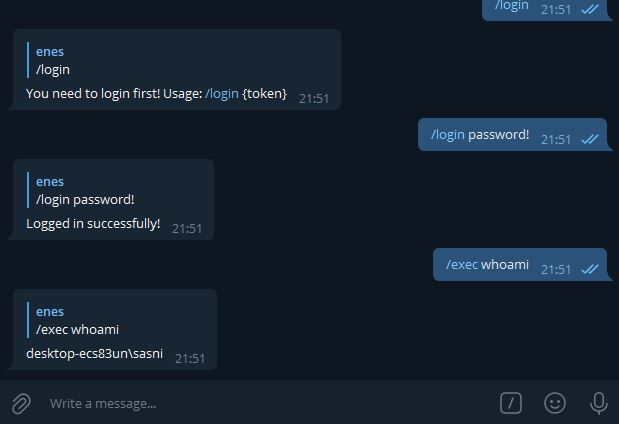

# BeeRat
Remote administration tool for Windows.

# FOR EDUCATIONAL PURPOSES ONLY!

You don't need a server to use this rat but a telegram bot.

# Installation

1) Create Telegram bot and save the token
2) Clone the repo with `git clone https://github.com/phlmox/BeeRat` and put your telegram bot token to the bee.go file. (Line 191)
3) Set your password in Line 192. (You'll use it to login telegram bot panel.)
4) Build the bee.go:

For Windows:
`
go build -ldflags -H=windowsgui bee.go
`

For Linux:
`
GOOS=windows GOARCH=amd64 go build -ldflags -H=windowsgui bee.go
`

## Commands for administration panel:

* /login {password} : You need to login to use the panel.
* /screenshot : Take a screenshot.
* /shutdown : Shutdown the computer.
* /exec {cmd} : Run terminal commands.
* /msgbox {title} | {body} : Show a messagebox on target computer.
* /logout : Logout. (When you run bee.exe later, you'll need to log in again)

This project is written in Golang
